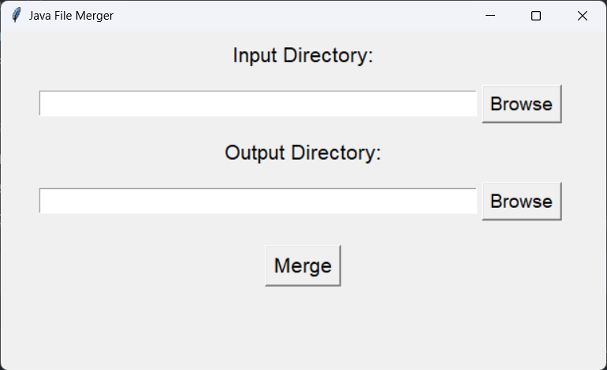

# Quera Project Fix 👨🏻‍🔧

This script provides a simple graphical interface to merge multiple Java files into a single file. It allows users to select an input directory containing Java files and specify an output directory where the merged file will be saved. The merging process removes package declarations and ensures the `Main` class is made public.


## Usage
**To use the Java File Merger script, follow these steps:**

1. Clone the repository to your local machine:

```bash
  git clone https://github.com/Yonesj/queraProjectFix.git
```

2. Navigate to the project directory:

```bash
  cd queraProjectFix
```
3. Run the script by executing the `main` file.

```bash
  python main.py
```

<br>


4. Select the input directory containing the Java files to merge.
5. Select the output directory where the merged file will be saved.
6. Click the "Merge" button to initiate the merging process.


## Note

This script assumes that the `Main.java` file serves as the entry point for the merged Java program. If your project has a different entry point or naming convention, you may need to customize the script accordingly to meet your specific requirements.

#
I Hope it will be useful for you 👨🏻‍🔧.